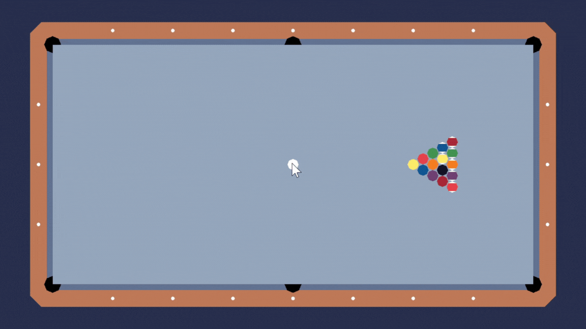

# Pool Simulator.

**Pool Simulator** is a 2D simulation of a pool game, implemented in C++.

## Features
- 2D Graphics (Mouse Support)
- Online multiplayer (Host and Client)
- API Support

## Table of Contents

- [Project Name](#project-name)
  - [Table of Contents](#table-of-contents)
  - [Description](#description)
  - [Prerequisites](#prerequisites)
    - [Compiling the Program](#compiling-the-program)
      - [Using Makefile](#using-Makefile)
      - [Using Visual Studio Code](#using-visual-studio-code)
      - [Using the Precompiled Version](#using-the-precompiled-version)
  - [Usage](#usage)
  - [API](#api)
  - [References](#references)

## Prerequisites
- [OpenGL](https://www.opengl.org/)
- [GLFW](https://www.glfw.org/download.html)
- [glm](https://sourceforge.net/projects/glm.mirror/)
- [glad](https://glad.dav1d.de/)

## Compiling the Program

You have two options for compiling the program: using **Visual Studio Code** or the **Makefile**. For windows, the glfw library are already included but for linux, you will need to install the `libglfw-dev` package yourself.

### Using the Makefile

1. Open your terminal or command prompt.
2. Navigate to the project directory.
3. Run the `make` command to compile the program. 

### Using Visual Studio Code

1. Open the folder in Visual Studio Code.
2. Run the build task to compile the code. The shortcut is `Crtl-Shift-B`.
3. Select your operating system when prompted.

### Using the Precompiled Version
For a quick start, use the precompiled binaries:
- Windows: `pool_simulator.exe`
- Linux: `pool_simulator`

## Usage
To interact with the cue ball:

1. **Click and drag** on the cue ball.
2. A directional line will appear to adjust direction and force.
3. Release to hit the ball. 
> **Note**: The cue ball can only be hit when all other balls are stationary.
 
## API
The program accepts game state arguments to simulate a round.

### Arguments:
1. First 32 values: x and y coordinates of all balls.
2. Last two values: i and j velocity vectors for the cue ball (range: -1 to 1).

### Example
- Balls are in a triangle formation.
- The cue ball starts at the center with a velocity of (1, 0), moving right to triangle formation.

#### On Windows
`./pool_simulator.exe 24 0 25.948557 -1.125 25.948557 1.125 27.897114 -2.25 27.897114 0 27.897114 2.25 29.84567 -3.375 29.84567 -1.125 29.84567 1.125 29.84567 3.375 31.79423 -4.5 31.79423 -2.25 31.79423 0 31.79423 2.25 31.79423 4.5 0 0 1 0`

#### On Linux
`./pool_simulator.exe 24 0 25.948557 -1.125 25.948557 1.125 27.897114 -2.25 27.897114 0 27.897114 2.25 29.84567 -3.375 29.84567 -1.125 29.84567 1.125 29.84567 3.375 31.79423 -4.5 31.79423 -2.25 31.79423 0 31.79423 2.25 31.79423 4.5 0 0 1 0`

## References

- [Pool Physics Property Constants](https://billiards.colostate.edu/faq/physics/physical-properties/): Constants used for calculation
- [HTML5 & JavaScript Game Development Tutorial](https://spicyyoghurt.com/tutorials/html5-javascript-game-development/collision-detection-physics): Circle collision tutorial
- [Black Octagon](https://globalsymbols.com/symbolsets/openmoji/symbols/44281?locale=en): Image use for the icon
